# EsigProject

### Implementação de Jenkins conteinerizado em Tomcat + Monitoração com Prometheus e Grafana.

Aplicações Usadas/Versão:

- Tomcat 9.0.76
- Jenkins Latest
- OpenJDK 11
- Docker Latest
- Prometheus Latest
- Grafana Latest
- Prometheus Metrics Plugin 787.v52e8f47488fc


---

### Implementando o Tomcat

Para iniciar a instalação das nossas aplicações usadas na atividade, utilizaremos nesse caso o sistema operacional Debian. É essencial que tenhamos o sistema atualizado, dessa forma vamos utilizar o comando abaixo para buscar atualizações e instalá-las:

```bash
sudo apt update && sudo apt upgrade -y
```

Após baixar a instalar os pacotes mais recentes no sistema, devemos realizar o download do OpenJDK com o seguinte comando:

```bash
sudo apt install openjdk-11-jdk -y
```

Com o OpenJDK devidamente instalado o próximo passo é realizar o download e instalação do Tomcat. Antes de utilizar o comando para download do Tomcat, vamos navegar até a pasta padrão de instalação com o comando abaixo:

```bash
cd /opt/
```

Estando dentro do diretório vamos realizar o download do tomcat conforme versão indicada no comando abaixo:

```bash
wget https://archive.apache.org/dist/tomcat/tomcat-9/v9.0.76/bin/apache-tomcat-9.0.76.tar.gz
```

Como podemos notar, foi realizado download de um arquivo compactado, sendo necessário descompactá-lo para que os arquivos do tomcat sejam utilizados em nosso projeto. Iremos utilizar o comando abaixo para descompactar os arquivos:

```bash
sudo tar xzvf apache-tomcat-9.0.76.tar.gz
```

Após descompactar o arquivo o resultado é a criação de uma pasta com o nome apache-tomcat-9.0.76, vamos renomear esta pasta para tomcat9 afim de padronizar nossa instalação e facilitar as demais tarefas para entrega do projeto com o comando abaixo:

```bash
sudo mv apache-tomcat-9.0.76 tomcat9
```

Utilizando o comando acima já teremos o diretório do tomcat devidamente criado, entretanto, por padrão o tomcat necessita de um usuário para sua inicialização e gerência das pastas e conteúdos da aplicação. Seguindo as boas práticas de segurança iremos criar um novo grupo e usuário com o nome de tomcat e restringir suas permissões apenas para a gerência da aplicação. 

Vamos ao comando de criação do grupo de usuário:

```bash
sudo groupadd tomcat
```

Agora vamos criar o usuário tomcat, indicando que não será necessário a criação de um novo diretório home do usuário, impedindo que esse usuário faça login no sistema e especificando que o local onde instalamos nosso tomcat “**/opt/tomcat9**” será o home desse usuário. Segue o comando:

```bash
sudo useradd -M -s /bin/nologin -g tomcat -d /opt/tomcat9 tomcat
```

Seguindo com nosso projeto, vamos dar as devidas permissões ao usuário anteriormente criado para gerência das pastas da instalação do tomcat com o comando:

```bash
sudo chown -R tomcat:tomcat /opt/tomcat9
```

Também vamos dar permissão para que os scripts de inicialização localizados na pasta “**/opt/tomcat9/bin**” tenham permissão de execução, esse comando é importante para que no futuro possamos criar nosso serviço do tomcat:

```bash
sudo chmod +x /opt/tomcat9/bin/*.sh
```

Prosseguindo, vamos realizar a criação do nosso serviço do tomcat. Ele é vital para que o nosso tomcat seja iniciado automaticamente após reinicializações do sistema sem a necessidade de nenhuma intervenção manual.

Vamos criar um arquivo de serviço no qual vamos alimentar com os parâmetros do serviço, esse arquivo deverá estar localizado dentro do diretório padrão do debian.

Segue o comando:

```bash
sudo nano /etc/systemd/system/tomcat.service
```

Após utilizar o comando acima o editor nano será aberto com o arquivo tomcat.service no qual deverá ser alimentado com os parâmetros de inicialização do nosso tomcat.

O arquivo deverá conter os parâmetros a seguir:

```bash
[Unit]
Description=Apache Tomcat Web Application Container
After=network.target

[Service]
Type=forking

# Especifica o usuário e grupo anteriormente criados os quais o tomcat será executado
User=tomcat
Group=tomcat

# Especifica os diretórios de instalação do tomcat, é importante verificar também se o diretório do java condiz com o da versão instalada, no nosso caso é a versão 11.
Environment="JAVA_HOME=/usr/lib/jvm/java-11-openjdk-amd64"
Environment="CATALINA_PID=/opt/tomcat9/temp/tomcat.pid"
Environment="CATALINA_HOME=/opt/tomcat9"
Environment="CATALINA_BASE=/opt/tomcat9"
Environment="CATALINA_OPTS=-Xms512M -Xmx1024M -server -XX:+UseParallelGC"
Environment="JAVA_OPTS=-Djava.awt.headless=true -Djava.security.egd=file:/dev/./urandom"

# Comandos de inicialização e parada do tomcat
ExecStart=/opt/tomcat9/bin/startup.sh
ExecStop=/opt/tomcat9/bin/shutdown.sh

# Permitir reinicializações automáticas em caso de falha
Restart=on-failure

[Install]
WantedBy=multi-user.target
```

Após gravar as informações do arquivo acima vamos utilizar o comando abaixo para o nosso SO verificar os arquivos de serviço no diretório padrão e identificar nosso novo arquivo criado:

```bash
sudo systemctl daemon-reload
```

Em seguida vamos ativar o serviço do tomcat com o comando:

```bash
sudo systemctl enable tomcat
```

Pronto, agora já podemos iniciar nosso tomcat com o comando abaixo e verificar seu funcionamento:

```bash
sudo systemctl start tomcat 
```

Podemos utilizar o comando abaixo para verificar o status do serviço do tomcat:

```bash
sudo systemctl status tomcat
```

Ao executar o comando acima e obter o retorno de “**Tomcat started.**”, podemos verificar o funcionamento do nosso tomcat acessando o endereço IP do nosso servidor na porta "8080". Nesse projeto o meu servidor está utilizando o IP 192.168.0.18, iremos utilizar o endereço: "**http://192.168.0.18:8080/**".


Como o tomcat foi executado sem erros, a tela abaixo foi a exibida:

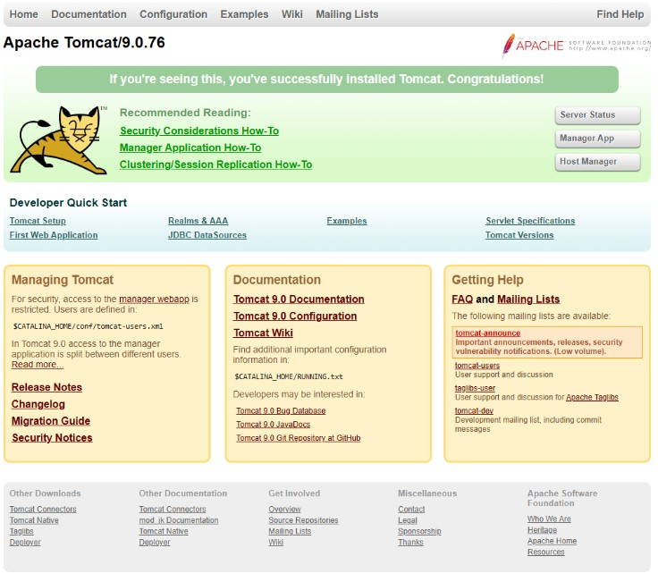


Nosso próximo passo é criar um usuário no tomcat para permitir o acesso a interface de gerência web das nossas aplicações.

Essa configuração é realizada no arquivo “**tomcat-users.xml**”, esse arquivo fica localizado na pasta “**/opt/tomcat9/conf**”.

Vamos abrir o arquivo para realizar as alterações com o seguinte comando:

```bash
sudo nano /opt/tomcat9/conf/tomcat-users.xml
```


Ao abrir o arquivo vamos encontrar as seguintes informações conforme tela abaixo:


Vamos adicionar as seguintes linhas dentro de “**<tomcat-users**”:

```bash
 <role rolename="manager-gui"/>
 <user username="admin" password="T0mC4t@eSiG2024" roles="manager-gui"/>
 ```

O argumento `<role rolename="manager-gui"/>` faz a definição de um novo grupo de acesso gerenciador do tomcat.
Já o argumento "`<user username="admin" password="T0mC4t@eSiG2024" roles="manager-gui"/>`" realiza criação de um usuário de nome admin com a senha especificada o incluindo no grupo manager-gui anteriormente criado.

Adicionando os argumentos acima, conseguimos fazer a criação do usuário de gerência com uma senha forte.

O Arquivo final deverá ficar desta forma:
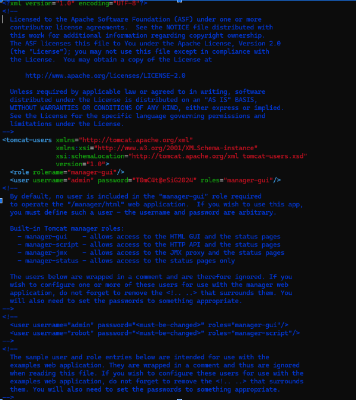

Devemos realizar o reinício do tomcat para verificar que o serviço irá funcionar normalmente depois das modificações com o comando:

```bash
sudo systemctl restart tomcat
```

Por padrão o tomcat permite o acesso a interface de gerência apenas pelo próximo servidor no qual a aplicação está instalada. Nosso próximo passo é realizar a liberação do acesso a interface web apenas do meu computador, simulando um ambiente de produção onde a segurança deverá ser mantida e esse acesso deverá ser restrito.

Essa liberação é realizada no arquivo “**web.xml**” localizado no diretório “**/opt/tomcat9/webapps/manager/WEB-INF/**”.

No nosso caso, vamos alterar a sessão Valve e adicionar argumentos que permitam o apenas nosso **IP 192.168.0.100** e o próprio servidor o acesso a interface.

Vamos abrir o arquivo com o comando abaixo:

```bash
sudo nano /opt/tomcat9/webapps/manager/WEB-INF/web.xml
```

Após abertura do arquivo vamos alterá-lo de forma que ele fique com a sessão Valve idêntica como a da imagem abaixo:

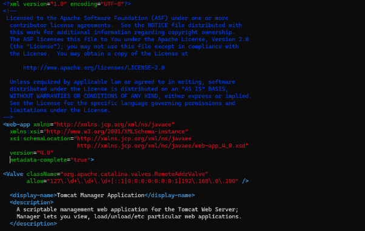


Após salvar as alterações acima feitas devemos reiniciar novamente o tomcat para aplicar as alterações:

```bash
sudo systemctl restart tomcat
```

Após o tomcat reiniciado e sem erros, vamos acessar a página de gerência com o usuário e senha criados anteriormente pelo endereço: 

```bash
http://192.168.0.18:8080/manager/
```

Durante o acesso, usuário e senha serão solicitados conforme a imagem abaixo:

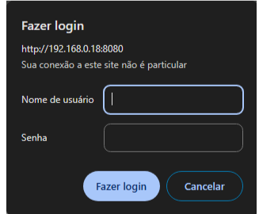


Após inserir o usuário e senha criados, “**admin**” e “**T0mC4t@eSiG2024**” seremos redirecionados à página de gerência:

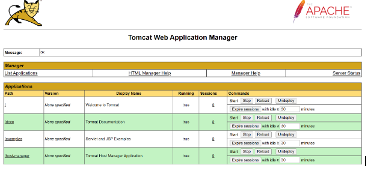

---

### Implementação do Jenkins
Com essas configurações devidamente realizadas, nosso tomcat está pronto e agora podemos realizar a instalação do Jenkins integrado ao nosso tomcat.

Para isso, devemos usar a versão mais atual do Jenkins que atualmente é a 2.462.3.

O próximo passo é baixar o arquivo .war do Jenkins diretamente no site oficial e inseri-lo no diretório padrão de deploy do Tomcat, tal diretório é o “**/opt/tomcat9/webapps/**”.

Primeiro vamos navegar até o diretório mencionado acima:

```bash
cd /opt/tomcat9/webapps/
```

Após isso vamos utilizar o comando wget para download do arquivo oficial:

```bash
wget https://get.jenkins.io/war-stable/2.462.3/jenkins.war
```

Após download no diretório correto, vamos reiniciar o tomcat para que ele faça deploy automaticamente do arquivo do Jenkins:

```bash
sudo systemctl restart tomcat
```

Com o tomcat devidamente reiniciado, vamos acessar novamente a interface de gerência do tomcat para verificar se o Jenkins foi iniciado pelo link `http://192.168.0.18:8080/manager`.

Após acessar notamos que o Jenkins já está listado e iniciado conforme imagem abaixo:

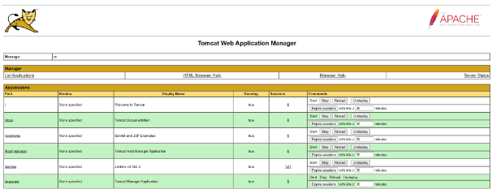

O Jenkins poderá ser acessado via web pelo link `http://192.168.0.18:8080/jenkins`:

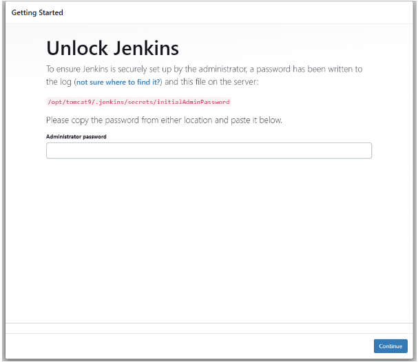

Durante nosso primeiro acesso, será necessário inserir a senha de primeiro acesso gerada automaticamente e que está localizada em “`/opt/tomcat9/.jenkins/secrets/initialAdminPassword`”.

Em nosso Debian, vamos utilizar o comando abaixo para identificar a senha mencionada:

```bash
cat /opt/tomcat9/.jenkins/secrets/initialAdminPassword
```
No nosso caso a senha gerada foi a “`ad262203c0e04955897b4848301dfc54`”, essa senha será trocada nas telas seguintes do Jenkins.

Ao inserir a senha acima e prosseguir, a tela de customização do Jenkins é exibida e especificamente nesse caso vamos selecionar a opção de instalar plugins sugeridos:

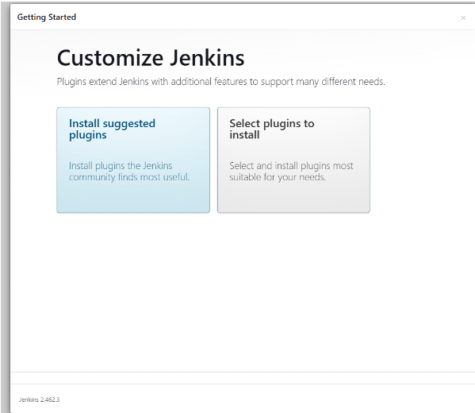

Após a aplicação finalizar a instalação dos plugins, seremos redirecionados a tela de criação do usuário administrador. Vamos preencher os novos dados de usuário, salvar e continuar. Note que nesse caso o novo usuário será “`admin`” e a nova senha será “`J3nk1nS@eSiG2024`”.  

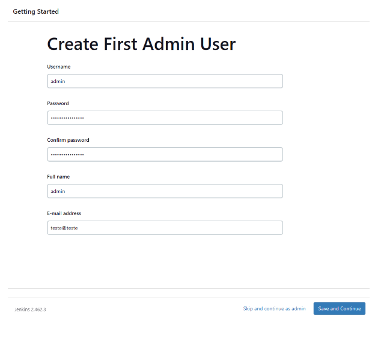

Na próxima tela será solicitada a configuração de URL de aplicação do Jenkins, vamos manter a padrão, salvar e finalizar:

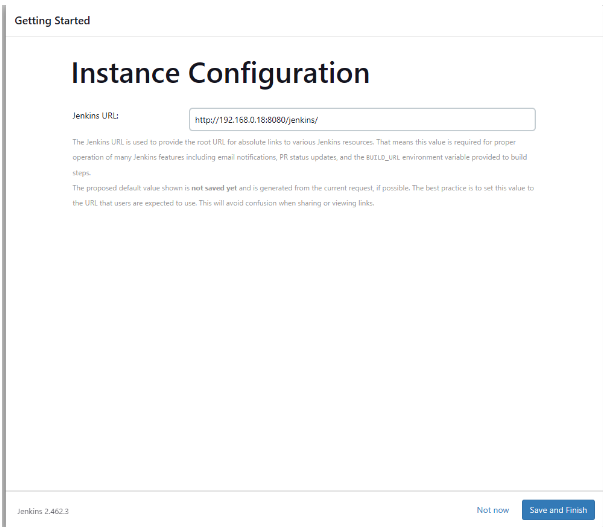


Feito, as configurações iniciais do Jenkins já estão feitas e ele está pronto para uso !

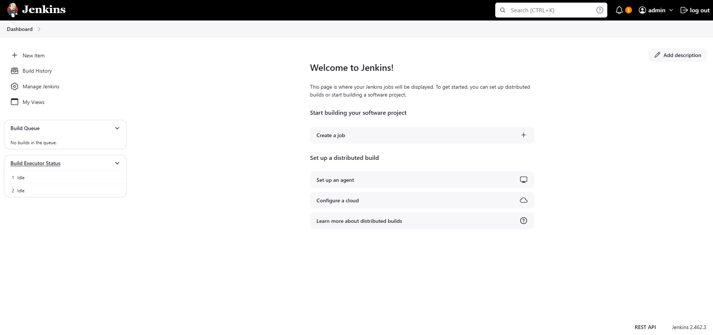


Pensando em monitorar nosso Jenkins no futuro, já vamos realizar a instalação de um plugin padrão que será bastante útil.

Vamos acessar a opção “**Manage Jenkins**” no menu da esquerda e logo após clicar em Plugins.

No mesmo menu da esquerda, vamos clicar em “**Available plugins**” e pesquisar por “**Prometheus metrics**”. Após encontrar o plugin desejado, vamos marcá-lo e clicar em instalar:

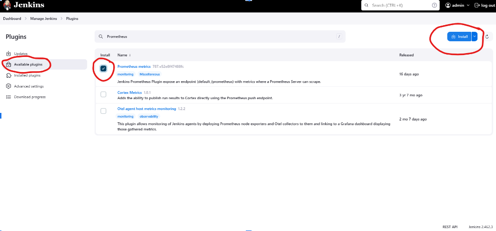

Devemos marcar a caixa de reinício do Jenkins para que ele seja reiniciado ao final da instalação.

Uma tela será exibida e o Jenkins será automaticamente aberto na página de login ao fim do seu reinício.

Pesquisando por Prometheus no menu de Plugins instalados podemos identificar que ele está ativo.

Como mencionado, futuramente iremos utilizar o plugin para monitoração do Jenkins.

---

### Implementação do Jboss em Docker

Dando seguimento ao nosso projeto, vamos realizar a instalação do Jboss em docker.

Para isso, vamos instalar o docker em nossa máquina debian 12. Novamente vamos atualizar e instalar nosso pacotes:
```bash
sudo apt update && sudo apt upgrade -y
```

O docker possui requisitos de pacotes e certificados para ser instalado, sendo assim vamos instalá-los antes de instalar o docker em si:

```bash
sudo apt install apt-transport-https ca-certificates curl software-properties-common gnupg2 lsb-release -y
```

Agora, vamos instalar a chave GPG oficial do docker, ela serve para garantir que os downloads de imagens sejam válidos e autênticos e também para verificar a integridade dos códigos:

```bash
curl -fsSL https://download.docker.com/linux/debian/gpg | sudo gpg --dearmor -o /usr/share/keyrings/docker-archive-keyring.gpg
```

Prosseguindo, vamos adicionar o repositório do Docker ao nosso SO:

```bash
echo "deb [arch=$(dpkg --print-architecture) signed-by=/usr/share/keyrings/docker-archive-keyring.gpg] https://download.docker.com/linux/debian $(lsb_release -cs) stable" | sudo tee /etc/apt/sources.list.d/docker.list > /dev/null
```

Atualizando novamente nossos repositórios:

```bash
sudo apt update
```

Instalando o Docker:

```bash
sudo apt install docker-ce docker-ce-cli containerd.io -y
```

Com o Docker instalado, vamos verificar se ele está rodando em nosso sistema:

```bash
sudo systemctl status docker
```

Com docker em execução, podemos testar com o comando em docker:

```bash
sudo docker run hello-world
```

Perfeito! o Docker está em perfeito funcionamento.

Agora, vamos dar permissão para nosso usuário atual executar comandos em docker sem a necessidade de usar o sudo. Esse comando é usado para facilitar e agilizar as execuções de usuário específicos no manuseio do docker:

```bash
sudo usermod -aG docker $USER
```

Para não termos que fazer logoff, vamos usar o comando abaixo para atualizar as permissões do nosso usuário

```bash
newgrp docker
```

Com as configurações realizadas, vamos agora habilitar o docker para iniciar junto com nosso SO:

```bash
sudo systemctl enable docker
```

Dando seguimento ao nosso projeto, vamos realizar agora a instalação do Jboss em docker.

Para isso vamos criar uma nova pasta em nosso diretório de usuário e acessá-la:

```bash
mkdir jboss
```

```bash
cd jboss/
```

Agora vamos criar nosso arquivo Dockerfile que será usado para gerar nosso container com as configurações necessárias:

```bash
sudo nano Dockerfile
```

Dentro do nosso arquivo Dockerfile, especificamos algumas configurações:

```bash
# Usando a imagem oficial do WildFly do Quay
FROM quay.io/wildfly/wildfly:latest

WORKDIR /app

# Copia, builda e move para pasta de deployments o projeto de teste .war
COPY java-example-helloworld-war/ .
RUN jar -cvf helloworld.war *.jsp WEB-INF
RUN mv -f helloworld.war /opt/jboss/wildfly/standalone/deployments/

# Adicionar um usuário de gerenciamento
RUN /opt/jboss/wildfly/bin/add-user.sh admin jB005@eSiG2024 --silent

# Expondo as portas do JBoss
EXPOSE 8090 9990

# Comando para iniciar o JBoss na porta 8090 e habilitar acesso e gerenciamento
CMD ["/opt/jboss/wildfly/bin/standalone.sh", "-b", "0.0.0.0", "-bmanagement", "192.168.0.100", "-Djboss.bind.address.management=0.0.0.0", "-Djboss.http.port=8090"]
```

Agora vamos fazer o deploy da aplicação


```bash
docker compose up -d --build
```

Agora, vamos acessar a nossa aplicação de exemplo que está especificada no Dockerfile acima.

Acessando o link `http://192.168.0.18:8090/helloworld` teremos acesso a ela.


Assim finalizamos a implementação do nosso Jboos rodando em uma porta diferente do nosso tomcat.

---

### Prometheus e Grafana em Docker

Continuando, iremos criar uma pasta com nome monitoring onde armazenaremos os arquivos para construção dos containers Prometheus e Grafana.

```bash
mkdir monitoring
```

Vamos criar o arquivo prometheus.yml para atribuir as configurações que o Prometheus irá especificar como targets de monitoramento:

```bash
sudo nano prometheus.yml
```

Nosso arquivo irá indicar os targets do Tomcat, Jenkins e nossa máquina debian na qual todas aplicações estão instaladas:

```bash
global:
  scrape_interval: 15s

scrape_configs:
  
  - job_name: 'tomcat'
    static_configs:
      - targets: ['192.168.0.18:8081']

  - job_name: 'jenkins'
    metrics_path: /jenkins/prometheus
    scheme: http    
    static_configs:
      - targets: ['192.168.0.18:8080']
    tls_config:
      insecure_skip_verify: true

  - job_name: 'debian'
    static_configs:
      - targets: ['192.168.0.18:9100']
```
Em seguida criaremos o arquivo docker-compose.yml das aplicações

```bash
sudo nano docker-compose.yml
```

Esse será o conteúdo do nosso arquivo:

```bash
services:
   # Container Prometheus com Imagem atual e fazendo referência as configurações do .yml da aplicação
  prometheus:
    image: prom/prometheus:latest
    container_name: prometheus
    volumes:
      - ./prometheus.yml:/etc/prometheus/prometheus.yml
    ports:
      - "9090:9090"
    restart: unless-stopped
   # Container grafana com Imagem atual
  grafana:
    image: grafana/grafana:latest
    container_name: grafana
    volumes:
      - ./grafana:/var/lib/grafana
    ports:
      - "3000:3000"
    restart: unless-stopped
```    

Prosseguindo, vamos iniciar as aplicações para testar o funcionamento:

```bash
docker compose up -d --build
```

Após as aplicações inciarem poderemos acessar usando os links abaixo:

``http://192.168.0.18:9090/``


``http://192.168.0.18:3000/``

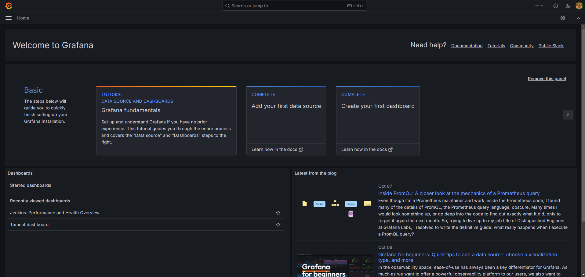

Como as portas de monitoramento dos nosso hosts já haviam sido configuradas nos arquivos dos containers, realizei a importação de templates padrão no grafana para monitoramento do Tomcat, Jenkins, Debian.

Nosso ambiente está pronto !
